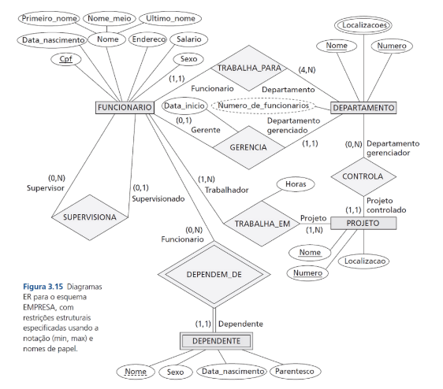
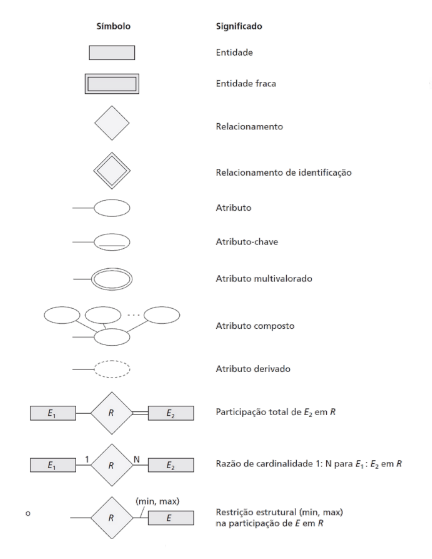

# Banco de Dados Relacional
O modelo relacional representa o banco de dados como uma coleção de relações. Quando uma relação é considerada uma tabela de valores, cada linha na tabela representa uma coleção de valores de dados relacionados.

Na terminologia formal do modelo relacional:
- uma linha é chamada de **tupla**,
- um cabeçalho da coluna é chamado de **atributo** e 
- a tabela é chamada de **relação**.
- O tipo de dado que descreve os tipos de valores que podem aparecer em cada coluna é representado por um **domínio** de valores possíveis.
 
Um **domínio D** é um conjunto de valores atômicos. Um exemplo de domínio é: 
- **Numeros_telefone_nacional**. O conjunto de números de telefone com onze dígitos válidos no Brasil.

Um tipo de dado ou formato também é especificado para cada domínio.

Um esquema de relação é usado para descrever uma relação; R é chamado de nome dessa relação. O grau (ou aridade) de uma relação é o número de atributos n desse esquema de relação.

## Características das relações
### Ordem dos valores dentro de uma tupla e uma definição alternativa de uma relação
Uma tupla n é uma lista ordenada de n valores, de modo que a ordem dos valores em uma tupla — e, portanto, dos atributos em um esquema de relação — é importante. No entanto, em um nível mais abstrato, a ordem dos atributos e seus valores não é tão importante, desde que a correspondência entre atributos e valores seja mantida.

Uma definição alternativa de uma relação pode ser dada, tornando desnecessária a ordem dos valores em uma tupla. A ordem dos atributos não é importante, pois o nome do atributo aparece com seu valor.

### Valores e NULLs nas tuplas
Cada valor em uma tupla é um **valor atômico**. Um conceito importante é o dos valores NULL, que são usados para representar os valores de atributos que podem ser desconhecidos ou não se aplicam a uma tupla. Um valor especial, chamado NULL, é usado nesses casos. 

O significado exato de um valor NULL determina como ele será aplicado durante agregações aritméticas ou comparações com outros valores.

## Restrições em modelo relacional e esquemas de bancos de dados relacionais
As restrições nos bancos de dados geralmente podem ser divididas em três categorias principais:
1. Restrições inerentes no modelo de dados.
2. Restrições baseadas em esquema ou restrições explícitas.
3. Restrições baseadas na aplicação, restrições semânticas ou regras de negócios.

As restrições baseadas em esquema incluem:
1. restrições de domínio,
2. restrições de chave,
3. restrições sobre NULLs,
4. restrições de integridade de entidade e
5. restrições de integridade referencial.

## Operações de atualização, transações e tratamento de violações de restrição
Existem três operações básicas que podem mudar os estados das relações:
1. Inserir,
2. Excluir e
3. Alterar (ou Modificar).

- **Inserir (Insert)** é usado para inserir uma ou mais novas tuplas em uma relação.
- **Excluir (Delete)** é usado para excluir tuplas.
- **Alterar (Update ou Modificar)** é usado para alterar os valores de alguns atributos nas tuplas existentes.

Uma **transação** é um programa em execução que inclui algumas operações de banco de dados, como fazer a leitura do banco de dados ou aplicar inserções, exclusões ou atualizações a ele. Ao final da transação, ela precisa deixar o banco de dados em um estado válido ou consistente, que satisfaça todas as restrições especificadas no esquema do banco de dados.

Uma única transação pode envolver qualquer número de operações de recuperação e qualquer número de operações de atualização.

## Modelagem de dados usando o modelo Entidade-Relacionamento (ER)

### Tipos de entidade, conjuntos de entidades, atributos e chaves

#### Entidades e seus atributos
O conceito básico que o modelo ER representa é uma **entidade**, que é uma coisa ou objeto no mundo real com uma existência independente. Cada entidade possui **atributos** — as propriedades específicas que a descrevem. Vários tipos de atributos ocorrem no modelo ER:
1. simples versus composto,
2. valor único versus multivalorado e
3. armazenado versus derivado.

#### Atributo composto versus simples
- **Atributos compostos** podem ser divididos em subpartes menores, que representam atributos mais básicos, com significados independentes. 
- Os atributos não divisíveis são chamados **atributos simples** ou **atômicos**.
- Atributos compostos são úteis para modelar situações em que um usuário às vezes se refere ao atributo composto como uma unidade, mas outras vezes se refere especificamente a seus componentes. Se o atributo composto for referenciado apenas como um todo, não é necessário subdividi-lo em atributos componentes.

#### Atributos de valor único versus multivalorados
- A maioria dos atributos possui um valor único para uma entidade em particular; tais atributos são chamados de **valor único**.
- Um **atributo multivalorado** pode ter um limite mínimo e um máximo para restringir o número de valores permitidos para cada entidade individual.

#### Atributos armazenados versus derivados
Em alguns casos, dois (ou mais) valores de atributo estão relacionados. 
- Para uma entidade de pessoa em particular, o valor de Idade pode ser determinado pela data atual (hoje) e o valor da Data_nascimento dessa pessoa. 
- O atributo Idade, portanto, é chamado de **atributo derivado** e considerado derivável do atributo Data_nascimento, que é chamado, por sua vez, de **atributo armazenado**.

#### Atributos complexos
Podemos representar o aninhamento arbitrário ao agrupar componentes de um atributo composto entre parênteses ( ) e separá-los com vírgulas, e ao exibir os atributos multivalorados entre chaves { }. Esses atributos são chamados de **atributos complexos**. Exemplo: { Endereco_telefone({Telefone(Codigo_área,Numero_telefone)}, Endereco(Logadrouro(Numero,Rua,Numero_ap),Cidade,Estado,Cep) )}

#### Tipos de entidade
Um **tipo de entidade** define uma coleção (ou conjunto) de entidades que têm os mesmos atributos. A coleção de todas as entidades de determinado tipo de entidade no banco de dados, em qualquer ponto no tempo, é chamada de **conjunto de entidades** ou **coleção de entidades**. Um tipo de entidade descreve o **esquema** ou **conotação** para um conjunto de entidades que compartilham a mesma estrutura. A coleção de entidades de determinado tipo é agrupada em um conjunto de entidades, que também é chamado de **extensão do tipo de entidade**.

#### Atributos-chave de um tipo de entidade
Um tipo de entidade normalmente tem um ou mais atributos cujos valores são distintos para cada entidade individual no conjunto de entidades. Esse atributo é denominado **atributo-chave**, e seus valores podem ser usados para identificar cada entidade de maneira exclusiva. Alguns tipos de entidade possuem mais de um atributo-chave.

### Tipos e conjuntos de relacionamentos, papéis e restrições estruturais
Um tipo de relacionamento *R* entre *n* tipos de entidade *E1, E2, ..., En* define um conjunto de associações — ou um conjunto de relacionamentos — entre as entidades desses tipos de entidade. Matematicamente, o conjunto de relacionamentos R é um conjunto de instâncias de relacionamento *ri*. Informalmente, cada instância de relacionamento *ri* em R é uma associação de entidades, em que a associação inclui exatamente uma entidade de cada tipo de entidade participante.

Nos diagramas ER, os tipos de relacionamento são exibidos como caixas em forma de losango, que são conectadas por linhas retas às caixas retangulares que representam os tipos de entidade participantes.

O **grau de um tipo de relacionamento** é o número dos tipos de entidade participantes. Às vezes, é conveniente pensar em um tipo de relacionamento binário em termos de atributos.

Cada tipo de entidade que participa de um tipo de relacionamento desempenha nele um papel em particular. O **nome do papel** significa o papel que uma entidade participante do tipo de entidade desempenha em cada instância de relacionamento, e ajuda a explicar o que o relacionamento significa. Os tipos de relacionamento costumam ter certas restrições.

A **razão de cardinalidade para um relacionamento binário** especifica o número máximo de instâncias de relacionamento em que uma entidade pode participar. A **restrição de participação** especifica se a existência de uma entidade depende de ela estar relacionada a outra entidade por meio do tipo de relacionamento. Essa restrição especifica o número mínimo de instâncias de relacionamento em que cada entidade pode participar, e às vezes é chamada de **restrição de cardinalidade mínima**. Existem dois tipos de restrições de participação — total e parcial.

### Tipos de entidade fraca
Tipos de entidade que não possuem atributos-chave próprios são chamados **tipos de entidade fraca**. Ao contrário, os tipos de entidade regulares que possuem um atributo-chave são chamados de **tipos de entidade fortes**.

As entidades pertencentes a um tipo de entidade fraca são identificadas por estarem relacionadas a entidades específicas de outro tipo em combinação com um de seus valores de atributo. Chamamos esse outro tipo de entidade de **tipo de entidade de identificação** ou **proprietário**, e chamamos o tipo de relacionamento que relaciona um tipo de entidade fraca a seu proprietário de r**elacionamento de identificação do tipo de entidade fraca**. Em diagramas ER, tanto um tipo de entidade fraca quanto seu relacionamento de identificação são distinguidos ao delimitar suas caixas e losangos com linhas duplas.

### Diagramas ER e convenções de nomes

Como uma prática geral, dada uma descrição narrativa dos requisitos do banco de dados, os substantivos que aparecem na narrativa tendem a gerar nomes de tipo de entidade, e os verbos tendem a indicar nomes de tipos de relacionamento. Os nomes de atributo costumam surgir de substantivos adicionais que descrevem os nomes correspondentes a tipos de entidade.

Outra consideração de nomeação envolve a escolha de nomes de relacionamento binário para tornar o diagrama ER do esquema legível da esquerda para a direita e de cima para baixo. O processo de projeto de esquema deve ser considerado um processo de refinamento iterativo, no qual um projeto inicial é criado e depois refinado iterativamente até que o mais adequado seja alcançado.

Existem muitas notações diagramáticas alternativas para exibir diagramas ER. Em geral, usa-se ou a notação de razão de cardinalidade/linha simples/linha dupla ou a notação (min, max). A notação (min, max) é mais precisa, e podemos usá-la para especificar algumas restrições estruturais para os tipos de relacionamento de maior grau. Porém, isso não é suficiente para especificar algumas restrições de chave nos relacionamentos de maior grau.

## O modelo Entidade-Relacionamento Estendido (EER)

### Subclasses, superclasses e herança
O primeiro conceito do modelo ER estendido (EER) ao qual nos dedicamos é o de um **subtipo** ou **subclasse** de um tipo de entidade. 

O nome de um tipo de entidade é usado para representar um tipo de entidade e o conjunto de entidades ou coleção de entidades desse tipo que existem no banco de dados.O conjunto de entidades em cada um dos agrupamentos é um subconjunto das entidades que pertencem ao conjunto de entidades FUNCIONARIO, significando que cada entidade que é membro de um desses subagrupamentos também é um funcionário.

Chamamos cada um desses subagrupamentos de **subclasse** ou **subtipo** do tipo de entidade FUNCIONARIO, e o tipo de entidade FUNCIONARIO é chamado de **superclasse** ou **supertipo** para cada uma dessas subclasses.

Chamamos o relacionamento entre uma superclasse e qualquer uma de suas subclasses de **relacionamento superclasse/subclasse**, ou **supertipo/subtipo**, ou **simplesmente classe/subclasse**.

Uma entidade não pode existir no banco de dados simplesmente por ser um membro de uma subclasse; ela também precisa ser um membro da superclasse. Contudo, não é necessário que toda entidade em uma superclasse seja um membro de alguma subclasse.

Dizemos que uma entidade que é um membro de uma subclasse **herda** todos os atributos da entidade como um membro da superclasse. A entidade também herda todos os relacionamentos de que a superclasse participa.

## Especiaização e Generalização
**Especialização** é o processo de definir um conjunto de subclasses de um tipo de entidade. Esse tipo de entidade é chamado de **superclasse da especialização**. O conjunto de subclasses que forma uma especialização é definido com base em alguma característica distinta das entidades na superclasse.

