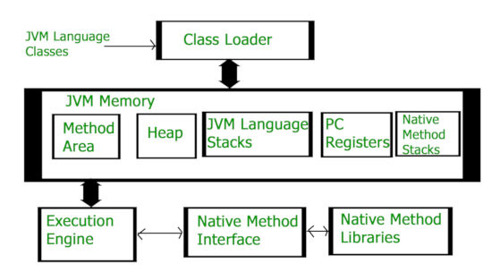

# Explicando a JVM (Java Virtual Machine)

## O que é JVM?
A JVM (Java Virtual Machine) é uma máquina virtual que executa o bytecode gerado pelo compilador Java. Ela é responsável por executar o código Java em qualquer plataforma que tenha a JVM instalada. 
Quando nos compilamos um arquivo **.java**, arquivos **.class** (que contém o byte-code) com os mesmos nomes das classes presentes em **.java** são gerados pelo compilador Java. A JVM é responsável por executar esses arquivos **.class**. A JVM é uma parte da JRE (Java Runtime Environment).
 
 

 
 
Componentes da JVM:
- Class Loader (Carregador de Classe)
- Run Time Data Area/JVM Memory (Areas de dados de tempo de execução)
- Execution Engine (Motor de Execução)
- Native Interfaces (Interfaces Nativas)
- Native Libraries (Bibliotecas Nativas)

## Class Loader
As Class Loaders são responsavéis por carregar classes Java dinamicamente para a JVM durante o tempo de execução. Elas também são parte da JRE. Assim, a JVM não precisa saber sobre arquivos underlying ou arquivos do sistema em ordem para executar programas Java, graças ao Class Loader.
 
Ela é responsavél por três atividades:
- Loading (Carregamento)
- Linking (Vinculação)
- Initialization (Inicialização)

### Loading
O Class Loader lê o arquivo **.class**, gera o código binário correspodente e salva as seguintes informações na memória da JVM chamada de method area (área de método):
- Nome da classe e seu imediato superclasse
- Se o **.class** é uma classe, interface ou enum
- Modificadores de acesso, métodos e variáveis de instância

Depois de carregar a classe, a JVM cria um objeto (único para cada) do tipo **CLass** para representa-lo na memória heap. É um objeto do tipo **java.lang.Class** portanto é possível usa-lo para acessar os métodos e variáveis da classe. Obetem-se essa referência através do método **getClass()** da classe **Object**.

### Linking
Desempenha três atividades:
- Verificação: Verifica se o arquivo está formatado corretamente e gerado por um compilador válido. Se não, obteremos a execeção de tempo de execução **java.lang.VerifyError**. Essa tarefa é feita pelo **Bytecode Verifier**.
- Preparação: A JVM aloca memória para variáveis estáticas e inicializa memória para valores padrão.
- Resolução (Opccional): Este é o processo de substituir referências simbólicas por referências diretas. Isso é feito procurando dentro da method area para localizar a entidade referenciada.

### Initialization
Nesta fase todas as variavéis estáticas são atribuídas com seus valores definidos no código. Isso é executado de cima pra baixo na classe e de pai para filho na hierarquia de herança.

Há três tipos de Classes Loaders:
- Bootstrap Class Loader: Superclasse de Extension Class Loader. Toda implementação da JVM deve ter uma Bootstrap Class Loader. Ele carrega o arquivo **rt.jar**, no diretório **JAVA_HOME/jre/lib**, que contém toda as classes do Java Standard Edition como o pacote **jav.lang**, **java.net**, **java.util** ...
- Extension Class Loader: Este é o class loader filho do Bootstrap Class Loader e pai do System Class Loader. Ele carrega o arquivo **jar** localizado dentro do diretório **JAVA_HOME/jre/lib/ext**.
- System/Application Class Loader: Filho do Extension Class Loader. Isto carega as classes para o **classpath**. Por padrão, o **classpath** está definido com o diretorio atual, mas você consegue trocar usando "-cp" ou "-classpath".

## Run Time Data Area/JVM Memory

### Method Area

## Execution Engine

## Native Interfaces

## Native Libraries

## Referências
[How JVM Works](https://www.geeksforgeeks.org/jvm-works-jvm-architecture/)
 
[JVM Architecture](https://www.javatpoint.com/jvm-java-virtual-machine)
